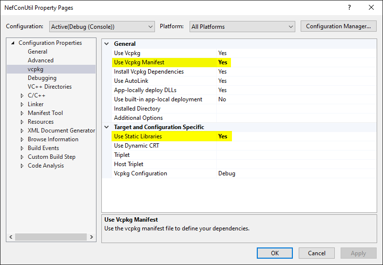

# neflib

[](https://github.com/nefarius/neflib/actions/workflows/msbuild.yml)


My opinionated collection of C++ utilities.

## About

Work in progress 🔥 Consider this as "stable to use" but "no stable API" since I am still experimenting and changing things frequently. The version "1.0.0" of the package will be frequently available under new commit hashes until it stabilizes. You have been warned, have fun exploring!

## How to use

I recommend you use [vcpkg](https://github.com/microsoft/vcpkg) to consume the library, alternatively you can just clone, build and link against the resulting static library.

### Library

To grab and built it automatically via package manager first create a `vcpkg-configuration.json` containing:

```json
{
  "registries": [
    {
      "kind": "git",
      "repository": "https://github.com/nefarius/nefarius-vcpkg-registry.git",
      "baseline": "a51cec12849ac113d4b8436c80bcf0b989668f90",
      "packages": [ "neflib" ]
    }
  ],
  "default-registry": {
    "kind": "git",
    "repository": "https://github.com/microsoft/vcpkg",
    "baseline": "3508985146f1b1d248c67ead13f8f54be5b4f5da"
  }
}
```

This will make vcpkg aware of [my own package registry](https://github.com/nefarius/nefarius-vcpkg-registry) in addition to the built-in one. The `baseline` tags and hashes might become outdated fast so look them up before copying them verbatim.

Now create a `vcpkg.json` manifest for your project similar to this:

```json
{
  "name": "demoproject",
  "version": "1.0.0",
  "description": "demoproject",
  "license": "MIT",
  "supports": "!(arm | uwp)",
  "dependencies": [
    "neflib",
    "wil"
  ]
}
```

After both these files are placed in the project directory, make sure to tell VS to use the manifest and linking options:



Now each time you build, the latest public version of `neflib` will be pulled, built and linked with your project 💪

### Includes

My philosophy is having my code stay out of your project structures' and preferences way as much as possible. I dislike libraries that force-include a ton of additional headers hidden away from you which might cause conflicts in bigger projects. This is the *recommended* minimal requirement and order of additional includes (OS APIs, STL etc.) you will need to use the full feature set of the library. You may get away with less if you only use a sub-set of the library:

```cpp
//
// Include WinAPI stuff
// 
#define WIN32_LEAN_AND_MEAN
#define NOMINMAX
#include <Windows.h>
#include <ShlObj.h>
#include <SetupAPI.h>
#include <newdev.h>
#include <tchar.h>
#include <initguid.h>
#include <devguid.h>
#include <shellapi.h>
#include <TlHelp32.h>
#include <cfgmgr32.h>

//
// Include consumed STL
// 
#include <string>
#include <type_traits>
#include <vector>
#include <format>
#include <expected>
#include <algorithm>
#include <variant>

//
// Vcpkg dependencies
// 
#include <wil/resource.h>

//
// Public headers
// 
#include <nefarius/neflib/AnyString.hpp>
#include <nefarius/neflib/UniUtil.hpp>
#include <nefarius/neflib/HDEVINFOHandleGuard.hpp>
#include <nefarius/neflib/HKEYHandleGuard.hpp>
#include <nefarius/neflib/INFHandleGuard.hpp>
#include <nefarius/neflib/GenHandleGuard.hpp>
#include <nefarius/neflib/LibraryHelper.hpp>
#include <nefarius/neflib/MultiStringArray.hpp>
#include <nefarius/neflib/Win32Error.hpp>
#include <nefarius/neflib/ClassFilter.hpp>
#include <nefarius/neflib/Devcon.hpp>
#include <nefarius/neflib/MiscWinApi.hpp>
```

This approach is also compatible with the (optional) use of precompiled headers 😎

## Sources and 3rd party credits

- [Windows Implementation Library](https://github.com/microsoft/wil)
- [Microsoft Research Detours Package](https://github.com/microsoft/Detours)
- [A modern C++ scope guard that is easy to use but hard to misuse](https://github.com/ricab/scope_guard)
- @fredemmott bullying me into the use of C++23 😛
