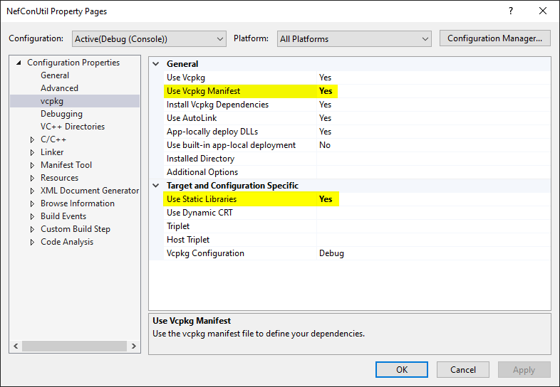

# neflib

[](https://github.com/nefarius/neflib/actions/workflows/msbuild.yml)


My opinionated collection of C++ utilities.

## About

This is a very opinionated C++23 library focussing on making interactions with the Windows API, devices and drivers management on Windows a more enjoyable experience.

## How to use

I recommend you use [vcpkg](https://github.com/microsoft/vcpkg) to consume the library, alternatively you can just clone, build and link against the resulting static library.

### Building from source

To build neflib locally from a clone:

1. **Clone with submodules:**
   ```powershell
   git clone --recurse-submodules https://github.com/nefarius/neflib.git
   ```
   Or for an existing clone:
   ```powershell
   git submodule update --init --recursive
   ```

2. **Bootstrap vcpkg** (first time only):
   ```powershell
   .\vcpkg\bootstrap-vcpkg.bat
   ```

3. **Build in Visual Studio** – MSBuild will run `vcpkg install` from the manifest during the build.

### Library

To grab and built it automatically via package manager first create a `vcpkg-configuration.json` containing:

```json
{
  "registries": [
    {
      "kind": "git",
      "repository": "https://github.com/nefarius/nefarius-vcpkg-registry.git",
      "baseline": "a51cec12849ac113d4b8436c80bcf0b989668f90",
      "packages": [ "neflib" ]
    }
  ],
  "default-registry": {
    "kind": "git",
    "repository": "https://github.com/microsoft/vcpkg",
    "baseline": "3508985146f1b1d248c67ead13f8f54be5b4f5da"
  }
}
```

This will make vcpkg aware of [my own package registry](https://github.com/nefarius/nefarius-vcpkg-registry) in addition to the built-in one. The `baseline` tags and hashes might become outdated fast so look them up before copying them verbatim.

Now create a `vcpkg.json` manifest for your project similar to this:

```json
{
  "name": "demoproject",
  "version": "1.0.0",
  "description": "demoproject",
  "license": "MIT",
  "supports": "!(arm | uwp)",
  "dependencies": [
    "neflib",
    "wil"
  ]
}
```

After both these files are placed in the project directory, make sure to tell VS to use the manifest and linking options:



Now each time you build, the latest public version of `neflib` will be pulled, built and linked with your project 💪

### Includes

My philosophy is having my code stay out of your project structures' and preferences way as much as possible. I dislike libraries that force-include a ton of additional headers hidden away from you which might cause conflicts in bigger projects. This is the *recommended* minimal requirement and order of additional includes (OS APIs, STL etc.) you will need to use the full feature set of the library. You may get away with less if you only use a sub-set of the library:

```cpp
//
// Include WinAPI stuff
// 
#define WIN32_LEAN_AND_MEAN
#define NOMINMAX
#include <Windows.h>
#include <ShlObj.h>
#include <SetupAPI.h>
#include <newdev.h>
#include <tchar.h>
#include <initguid.h>
#include <devguid.h>
#include <shellapi.h>
#include <TlHelp32.h>
#include <cfgmgr32.h>

//
// Include consumed STL
// 
#include <string>
#include <type_traits>
#include <vector>
#include <format>
#include <expected>
#include <algorithm>
#include <variant>

//
// Vcpkg dependencies
// 
#include <wil/resource.h>

//
// Public headers
// 
#include <nefarius/neflib/AnyString.hpp>
#include <nefarius/neflib/UniUtil.hpp>
#include <nefarius/neflib/HDEVINFOHandleGuard.hpp>
#include <nefarius/neflib/HKEYHandleGuard.hpp>
#include <nefarius/neflib/INFHandleGuard.hpp>
#include <nefarius/neflib/GenHandleGuard.hpp>
#include <nefarius/neflib/LibraryHelper.hpp>
#include <nefarius/neflib/MultiStringArray.hpp>
#include <nefarius/neflib/Win32Error.hpp>
#include <nefarius/neflib/ClassFilter.hpp>
#include <nefarius/neflib/Devcon.hpp>
#include <nefarius/neflib/MiscWinApi.hpp>
```

This approach is also compatible with the (optional) use of precompiled headers 😎

### Optional: diagnostics

neflib never depends on a logging framework, but several multi-step operations (the device
restart ladder, INF `[DefaultInstall]`/`[DefaultUninstall]` processing, driver service deletion
retries, ...) have intermediate steps that are otherwise invisible - only the final
`std::expected`/result-struct outcome is normally observable. If you want that detail (e.g. to
feed your own "--verbose" flag), register a callback:

```cpp
#include <nefarius/neflib/Diagnostics.hpp>

nefarius::utilities::SetDiagnosticCallback([](const nefarius::utilities::DiagnosticEvent& event)
{
    // Forward to whatever logging framework (or none) your application uses.
    // event.Level, event.Phase, event.Operation, event.Subject, event.Win32Code, event.Message
});
```

This is entirely opt-in: with no callback registered (the default), emitting a `DiagnosticEvent`
is a no-op. See the comments in `Diagnostics.hpp` for the full thread-safety/re-entrancy contract.
`DiagnosticsFormat.hpp` additionally provides plain formatting helpers (`ToString(RestartStrategy)`,
`DescribeDeviceRestartResult`, ...) for the result structs in `DeviceRestart.hpp`, usable whether
or not you register a diagnostics callback at all.

### Driver store package management

`Devcon.hpp` exposes a small, self-contained API for inspecting and surgically removing packages
from the offline Windows driver store (`%WINDIR%\System32\DriverStore\FileRepository`), without
touching any device node - unlike `UninstallDriver`/`DiUninstallDriverW`, which also uninstall any
device still using the driver.

```cpp
nefarius::devcon::DriverStorePackageFilter filter;
filter.ClassGuid = myClassGuid;                     // optional
filter.ServiceName = L"MyFilterService";            // optional; class filter registration only
filter.OriginalInfNames = {L"mydriver.inf"};         // case-insensitive; at least one field required

// Read-only: see exactly what a removal would affect first.
if (const auto found = nefarius::devcon::FindDriverStorePackages(filter))
{
    for (const auto& pkg : found.value())
    {
        // pkg.DriverPackageInfPath, pkg.PublishedInfName, pkg.OriginalInfName, pkg.Provider,
        // pkg.DriverVer, pkg.ClassGuid, pkg.ServiceNames
    }
}

// Remove every matching package; a failure on one doesn't stop the others from being attempted.
bool rebootRequired = false;
if (const auto results = nefarius::devcon::RemoveDriverStorePackages(filter, &rebootRequired))
{
    for (const auto& result : results.value())
    {
        // result.Package, result.Removed, result.RebootRequired, result.Error
    }
}
```

Every populated `DriverStorePackageFilter` field must match (logical AND); a field that is
populated but unreadable for a given candidate (e.g. its class can't be determined) is treated as
a rejection, never a pass-through. A **fully empty filter is rejected** with
`ERROR_INVALID_PARAMETER` so this can never be used to sweep the entire driver store. Matching
proceeds from cheapest to most expensive criterion (a pure `OriginalInfNames` string comparison
before any INF is opened, then `Provider`/`DriverVer`, then the more expensive class/service-target
parse), so a large store with many candidates isn't paying for I/O on packages a cheap check
already ruled out. `ServiceName` matches an `UpperFilters`/`LowerFilters` class filter registration
(via `GetInfClassFilterTargets`) - it does **not** match a function driver's plain
`[...Services] AddService` entry.

`RemoveDriverStorePackage(FullInfPath, &rebootRequired)` remains available as a thin convenience
wrapper for the common single-file case: it derives the exact `{OriginalInfNames, Provider,
DriverVer}` identity from `FullInfPath` and delegates to `RemoveDriverStorePackages`, preserving
its original single-package contract (already-absent is treated as success). Register a
diagnostics callback (see above) to see exactly why each candidate matched or was rejected under
`--verbose`.

## Sources and 3rd party credits

- [Windows Implementation Library](https://github.com/microsoft/wil)
- [Microsoft Research Detours Package](https://github.com/microsoft/Detours)
- [A modern C++ scope guard that is easy to use but hard to misuse](https://github.com/ricab/scope_guard)
- @fredemmott bullying me into the use of C++23 😛
